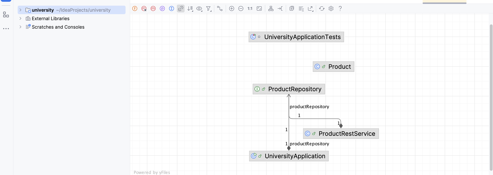
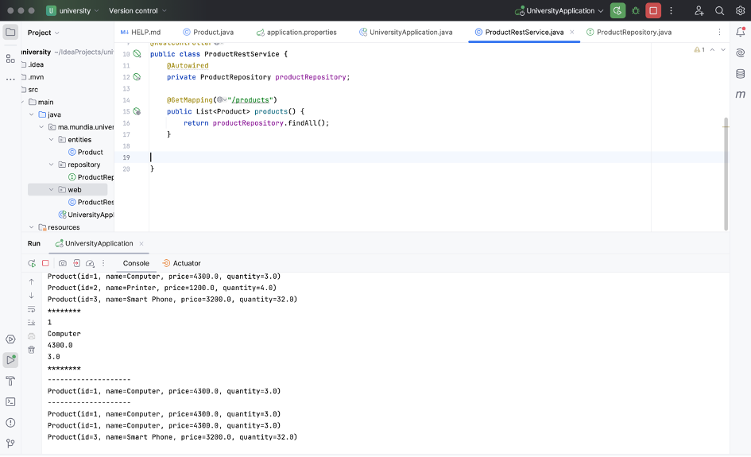

<h1> Rapport du TP3 : ORM JPA Hibernate Spring Data</h1>
<h2> Diagramme de classe : </h2>

<h2> L'initialisation du serveur spring  :  </h2>

<h2> La création du base de données Produits sur H2:</h2>

<h2> L'affichage de liste complète des produits:</h2>

<h2> L'affichage des informations d'un produit a partir de son id:</h2>

<h2> La création du base de données Produits sur phpMyAdmin :</h2>

<h2> L'affichage par mot clé (méthode Contains) :</h2>

<h2> L'affichage par mot clé (méthode Query) :</h2>

<h2>L'affichage par prix supérieur à un seuil (findByPrice) : </h2>

<h2>L'affichage par prix supérieur à un seuil (Query) : </h2>

<h2>L'affichage de tous les produits disponibles via API : </h2>

<h2>L'affichage de tous les produits disponibles via API par son ID : </h2>
<h3> id : 1 </h3>

<h3> id : 2 </h3>

